<h1 align="center">Fabrizio Carruitero</h1>

  Ingeniería Industrial · Ciencia de Datos · Machine Learning · Business Intelligence 
  Lima, Perú · <a href="https://linkedin.com/in/fabrizio-carruitero-27014a2ba">LinkedIn</a> · carruitero.fabrizio2404@gmail.com

  <picture>
    <source media="(prefers-color-scheme: dark)" srcset="assets/pipeline-dark.svg" />
    <source media="(prefers-color-scheme: light)" srcset="assets/pipeline-light.svg" />
    
  </picture>

---

### Sobre mí

Estudiante de Ingeniería Industrial en la UPC, orientado a datos. Vengo de procesos, así que no me interesa el modelo con el mejor score sino el que alguien puede usar: elijo el más simple cuando el empate es estadístico y lo dejo corriendo detrás de una API o un panel.

---

### Stack

| | |
|---|---|
| **Datos e IA** |      |
| **Producción** |     |
| **BI e Ingeniería** |     |

---

### Proyectos

#### 🛰️ [PreVe — Seguridad ciudadana predictiva](https://github.com/fcarruitero24/preve-hackathon-redpublica) · [demo en vivo ↗](https://fcarruitero24.github.io/preve-hackathon-redpublica/)

Hackathon RedPública · PNUD. Motor de ML (Random Forest, Regresión Logística, K-Means) que predice zonas de riesgo para jóvenes de 15–29 años en Lima Centro. La predicción sale del notebook por dos vías: un **mapa de calor** y un **chatbot de WhatsApp**.

#### 📉 [Predicción de fuga de clientes — API REST](https://github.com/fcarruitero24/churn-prediction-api) · [API en vivo ↗](https://churn-prediction-api-ruddy.vercel.app/docs)

Pipeline reproducible de punta a punta y su despliegue. Tres modelos comparados con validación cruzada de 5 pliegues; ante empate estadístico elegí el más simple (**ROC-AUC 0.835**) y lo traduje a bandas de riesgo: la banda alta se fuga a **2.35× la tasa base**.

> El modelo se exporta a un **JSON de 2.7 KB**, así que producción corre **sin scikit-learn**: 2 dependencias, **0.61 s** de arranque en frío, 38 pruebas automatizadas y CI.

El análisis completo que dio origen al modelo vive en [Customer-Churn-Prediction-End-to-End-ML-Pipeline](https://github.com/fcarruitero24/Customer-Churn-Prediction-End-to-End-ML-Pipeline).

#### 🏭 [Machine Learning aplicado a procesos industriales](https://github.com/fcarruitero24/UPC_projects_exams) · [panel en vivo ↗](https://fcarruitero24.github.io/UPC_projects_exams/)

Proyectos académicos UPC sobre rutas de e-commerce y control de calidad en inyección de plástico (**R² 0.879** con Árbol de Decisión). El panel incluye un simulador que ejecuta un **Random Forest de 100 árboles dentro del navegador**, sin servidor.

---

### Actividad

  <picture>
    <source media="(prefers-color-scheme: dark)" srcset="https://raw.githubusercontent.com/fcarruitero24/fcarruitero24/output/snake-dark.svg" />
    <source media="(prefers-color-scheme: light)" srcset="https://raw.githubusercontent.com/fcarruitero24/fcarruitero24/output/snake-light.svg" />
    
  </picture>

Se regenera sola cada dia con una GitHub Action de este repo (<code>.github/workflows/snake.yml</code>).

---

### Formación

**Universidad Peruana de Ciencias Aplicadas** — Ingeniería Industrial, 2023–presente · énfasis en Data, ML y BI.

IBM / Coursera — Machine Learning &amp; Data Science Professional Certificates · Sistemas UNI — Programming in Python (MTA), Algorithms and Data Structures · Udemy — Power BI: Professional Data Analysis · Microsoft AI Skills Fest 2026 · Inglés B2 (Duolingo English Test)

---

  
  

